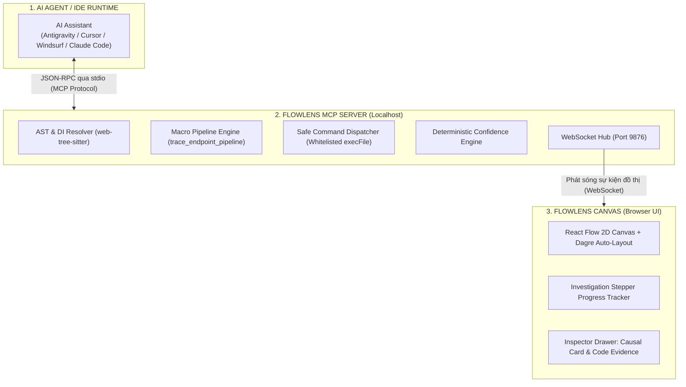
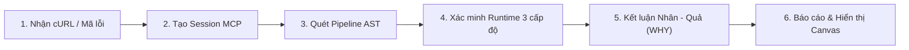

# 🔍 FlowLens: Universal API Execution Debugger & Real-time Causal Canvas

<p align="center">
  <b>The X-Ray HUD for AI Coding Agents</b><br/>
  <i>Biến quá trình điều tra lỗi API phức tạp thành sơ đồ thực thi 2D tương tác thời gian thực — Không ảo giác, minh bạch bằng chứng, kiểm soát nguyên nhân gốc rễ (Root Cause).</i>
</p>

<p align="center">
  
  
  
  
</p>

---

## 📖 Mục lục
- [1. Giới thiệu tổng quan](#1-giới-thiệu-tổng-quan)
- [2. Vấn đề thực tế & Giải pháp](#2-vấn-đề-thực-tế--giải-pháp)
- [3. Kiến trúc hệ thống tam giác](#3-kiến-trúc-hệ-thống-tam-giác)
- [4. Điểm khác biệt cốt lõi (Key Differentiators)](#4-điểm-khác-biệt-cốt-lõi-key-differentiators)
- [5. So sánh: AI Agent thông thường vs. AI Agent + FlowLens](#5-so-sánh-ai-agent-thông-thường-vs-ai-agent--flowlens)
- [6. Quy trình điều tra chuẩn (Investigation Protocol)](#6-quy-trình-điều-tra-chuẩn-investigation-protocol)
- [7. Công nghệ sử dụng (Tech Stack)](#7-công-nghệ-sử-dụng-tech-stack)
- [8. Hướng dẫn cài đặt & Cấu hình nhanh](#8-hướng-dẫn-cài-đặt--cấu-hình-nhanh)
- [9. Hướng dẫn sử dụng & Mẫu Prompt chuẩn (Prompt Recipes)](#9-hướng-dẫn-sử-dụng--mẫu-prompt-chuẩn-prompt-recipes)
- [10. Danh mục công cụ FlowLens MCP (Tools Reference)](#10-danh-mục-công-cụ-flowlens-mcp-tools-reference)
- [11. Danh mục MCP Resources & Prompts](#11-danh-mục-mcp-resources--prompts-chuẩn-model-context-protocol)
- [12. Hệ thống tài liệu chi tiết](#12-hệ-thống-tài-liệu-chi-tiết)
- [13. Lộ trình phát triển (Roadmap)](#13-lộ-trình-phát-triển-roadmap)

---

## 1. Giới thiệu tổng quan

**FlowLens** là một giải pháp mở rộng dành cho AI Coding Agents (như **Antigravity**, **Cursor**, **Windsurf**, **Claude Code**), bao gồm:
1. **Một Local MCP Server (Model Context Protocol):** Cung cấp các công cụ phân tích tĩnh ngữ nghĩa (AST), dò tìm chuỗi phụ thuộc (Dependency Injection) và thực thi test runner trong môi trường sandbox an toàn.
2. **Một Màn hình Canvas 2D tương tác thời gian thực (Interactive Real-time Canvas):** Khởi chạy cục bộ trên cổng `http://localhost:9876`, tự động vẽ lại toàn bộ luồng thực thi API từ Entrypoint đến Database, gắn nhãn trạng thái và highlight chính xác **điểm chết của request**.

> [!NOTE]
> FlowLens **không thay thế** AI Agent của bạn. FlowLens đóng vai trò như **hệ thống kính ngắm HUD và bảng điều khiển radar** được gắn thêm vào bộ não của Agent, giúp developer và AI cùng nhìn vào một bản đồ duy nhất để chốt lỗi.

---

## 2. Vấn đề thực tế & Giải pháp

### Bài toán nhức nhối khi debug API backend:
* **Hộp đen API đa tầng:** Một lỗi `403 Forbidden` hay `500 Internal Server Error` có thể phát sinh ở bất cứ đâu: API Gateway, Security Filter, DTO Validator, Interceptor, hay Service nghiệp vụ.
* **Sự sai lệch giữa Code trên đĩa và Thực tế chạy:** Code có thể định nghĩa việc ghi log hay lưu vào Database, nhưng thực tế runtime lại chết ngay tại bước xác thực token.
* **Hộp đen suy luận của AI (The Black-Box Agent):** Các AI Assistant thông thường chỉ đưa ra dòng chat văn bản. Khi AI sửa sai hoặc "chém gió" (hallucinate) do không đọc hết call graph, developer không có cách nào kiểm chứng được nếu không tự mình đọc lại từng file.

### Giải pháp từ FlowLens:
* **Hiển thị trực quan 2D:** Biến luồng text vô tận trong khung chat thành sơ đồ khối trực quan có màu sắc biểu thị rõ ràng.
* **Phân định rõ trạng thái 2 chiều:** Phân biệt rõ giữa code chỉ nằm trên đĩa (`NOT_VERIFIED`) với code thực sự đã chạy qua (`PASSED`), điểm gây sập (`STOPPED_HERE`), và tài nguyên hoàn toàn chưa bị chạm tới (`SKIPPED`).
* **Thẻ Causal WHY chuẩn hóa:** Bóc tách rõ ràng: **Điều kiện cần** vs **Dữ liệu thực tế gửi lên** vs **Dòng code gây lỗi**.

---

## 3. Kiến trúc hệ thống tam giác

FlowLens hoạt động dựa trên nguyên tắc **Tam giác phân vai (Triangle Architecture)**:



---

## 4. Điểm khác biệt cốt lõi (Key Differentiators)

1. **Deterministic Fact, AI Meaning (Sự thật tất định, AI suy luận ý nghĩa):**
   * Việc file có tồn tại không, symbol nằm ở dòng nào, test runner có pass hay không được đảm bảo 100% bằng công cụ tất định.
   * AI Agent chỉ tập trung vào thế mạnh duy nhất: Suy luận nhân-quả (*Tại sao điều kiện A không khớp với dữ liệu B?*).
2. **Cơ chế chấm điểm tin cậy có công thức định lượng (Confidence Engine):**
   $$\text{Confidence} = \min\left(1.0, \sum w_i\right)$$
   Độ tin cậy được tính dựa trên bằng chứng vật lý thu thập được (+0.4 nếu bắt được Route, +0.3 nếu khớp Stack Trace, -0.2 nếu trùng tên hàm do đa hình), triệt tiêu hoàn toàn sự tự tin thái quá của LLM.
3. **Phân tích AST giải quyết Đa hình & Dependency Injection:**
   Tích hợp `web-tree-sitter` (Tree-sitter WASM) siêu nhẹ để bóc tách annotation bean (`@Service`, `@Injectable`, `@Primary`), định vị chính xác implementation thực sự được nạp mà không cần dựng Language Server Protocol (LSP) ngốn GB RAM.
4. **Xác minh Runtime 3 cấp độ (Adaptive Runtime Verification):**
   * *Cấp 1 (Active):* Chạy test suite sẵn có qua runner an toàn (`mvn`, `gradle`, `npm`, `pytest`, `go`).
   * *Cấp 2 (Ephemeral Mock):* Tự động sinh file test mock tạm thời (`MockMvc`, `supertest`) để kích hoạt endpoint cô lập mà không phụ thuộc DB ngoài.
   * *Cấp 3 (Passive):* Đọc và so khớp log file/OpenTelemetry trace spans có sẵn khi môi trường không cho phép chạy lệnh.
5. **Composite Macro Tools (`trace_endpoint_pipeline`):**
   Gom toàn bộ pipeline khung từ Route $\rightarrow$ Filter $\rightarrow$ Service $\rightarrow$ Repo chỉ trong **1 round-trip duy nhất**, tiết kiệm hơn 70% token context cho Agent.

---

## 5. So sánh: AI Agent thông thường vs. AI Agent + FlowLens

| Tiêu chí | AI Agent thông thường trong IDE | AI Agent khi được tích hợp FlowLens MCP |
|---|---|---|
| **Giao diện phản hồi** | Chỉ có dòng chat text dài lê thê | Màn hình Canvas 2D tương tác, zoom/pan mượt mà |
| **Nhận thức kiến trúc** | Tìm kiếm text bằng regex thô (`grep`) | Bóc tách AST, hiểu rõ luồng Dependency Injection |
| **Quản lý trạng thái** | Phụ thuộc vào trí nhớ context của LLM (dễ quên) | State Machine chuẩn hóa (`NOT_VERIFIED`, `PASSED`, `STOPPED_HERE`) |
| **Phát hiện điểm chết** | AI tự phỏng đoán dòng lỗi | Khẳng định điểm dừng bằng bằng chứng stack trace / test log |
| **Số lần gọi tool (Calls)**| 15–20 tool calls đơn lẻ tốn kém | 1 Macro Tool duy nhất dựng xong toàn bộ khung pipeline |
| **Mức độ minh bạch** | "Hộp đen" — Không rõ AI đã kiểm tra những gì | "Bạch diện" — Toàn bộ bước điều tra đều hiện rõ trên Canvas |

---

## 6. Quy trình điều tra chuẩn (Investigation Protocol)

Khi người dùng cung cấp lệnh cURL lỗi hoặc mã lỗi API, quy trình 6 bước được kích hoạt:



* **Bước 1:** Nhận request lỗi và bóc tách parameters/headers.
* **Bước 2:** Khởi tạo `InvestigationSession` trên FlowLens Server và mở kênh WebSocket `9876`.
* **Bước 3:** Gọi `trace_endpoint_pipeline` tạo khung đồ thị tĩnh ban đầu (trạng thái `NOT_VERIFIED`).
* **Bước 4:** Chạy kiểm chứng runtime (Test có sẵn / Ephemeral Mock Test / Trace Log).
* **Bước 5:** Đánh dấu node lỗi là `STOPPED_HERE`, các node trước đó là `PASSED`, các node phía sau thành `SKIPPED`. Đính kèm Causal Card và trích dẫn mã nguồn thực tế (Code Evidence).
* **Bước 6:** Tự động đồng bộ toàn bộ đồ thị lên Canvas và trả kết luận cho developer.

---

## 7. Công nghệ sử dụng (Tech Stack)

```text
FlowLens Core Stack
├── MCP Protocol:      @modelcontextprotocol/sdk (TypeScript)
├── Server Runtime:    Node.js (v20+ LTS)
├── AST & DI Engine:   web-tree-sitter (Tree-sitter WASM)
├── Search Engine:     Ripgrep (ripgrep-js / regex lexical scanner)
├── Execution Sandbox: child_process.execFile (Whitelisted commands)
├── Communication:     ws (WebSocket Server port 9876)
├── Frontend UI:       React 19 + Vite
├── Graph Canvas:      @xyflow/react (React Flow)
├── Layout Engine:     dagre (@types/dagre)
└── Styling:           Tailwind CSS v4 + Lucide React
```

---

## 8. Hướng dẫn cài đặt & Cấu hình nhanh

### 8.1. Yêu cầu môi trường
* **Node.js:** Phiên bản `v20.0.0` trở lên.
* **Package Manager:** `npm` hoặc `pnpm`.
* Một AI Agent IDE hỗ trợ giao thức MCP (Antigravity, Cursor, Windsurf, Claude Code, Roo Code).

### 8.2. Cài đặt dự án
```bash
# Clone repository
git clone https://github.com/your-org/flowlens.git
cd flowlens

# Cài đặt dependencies
npm install

# Build mã nguồn TypeScript
npm run build
```

### 8.3. Cấu hình MCP Server vào IDE của bạn

Thêm cấu hình sau vào file cấu hình MCP của IDE (ví dụ: `mcp_config.json` của Antigravity/Cursor/Windsurf hoặc `claude_desktop_config.json`):

```json
{
  "mcpServers": {
    "flowlens": {
      "command": "node",
      "args": ["d:/MyProject/FlowLens/dist/server.js"],
      "env": {
        "FLOWLENS_PORT": "9876"
      }
    }
  }
}
```

> [!TIP]
> Trên hệ điều hành Windows, hãy sử dụng dấu gạch chéo xuôi `/` trong mảng `args` như trên (`d:/MyProject/FlowLens/dist/server.js`) để đảm bảo Node.js phân giải đường dẫn chính xác.

### 8.4. Cấu hình Rule để AI Agent luôn tự động kích hoạt FlowLens

Để AI Agent (Cursor, Antigravity, Claude Code) **luôn luôn nhớ dùng FlowLens** ngay khi bạn chỉ chat vắn tắt *"tôi bị lỗi này"*, hãy tạo hoặc thêm vào file quy tắc dự án (ví dụ `.cursorrules` hoặc `AGENTS.md` tại thư mục gốc của project bạn đang làm việc):

```markdown
# FlowLens Autonomous Investigation Protocol
Khi người dùng thông báo lỗi API, gửi lệnh cURL lỗi hoặc dán log stack trace:
1. Luôn kích hoạt tool `trace_endpoint_pipeline` của FlowLens MCP để quét AST và dựng sơ đồ luồng thực thi lên Canvas (http://localhost:9876).
2. Kiểm tra các rào chắn điều kiện (@PreAuthorize, Guard, Validation DTO, if-throw) tại Controller và Service.
3. Cập nhật điểm dừng thực tế `STOPPED_HERE` và các node sau thành `SKIPPED` thông qua tool `update_investigation_session`.
4. Đính kèm phân tích Causal WHY (Condition, Actual State, Verdict, Recommendation) và Code Evidence để developer đối chiếu trực quan.
```

---

## 9. Hướng dẫn sử dụng & Mẫu Prompt chuẩn (Prompt Recipes)

FlowLens hỗ trợ 2 chế độ làm việc linh hoạt:

### 9.1. Chế độ 1: Thử nghiệm trực tiếp trên Web Canvas (Không cần kết nối Agent)
Khi muốn xem thử cách FlowLens phân tích hoặc demo cho đồng nghiệp:
1. Đảm bảo server đang chạy (`npm start` hoặc process chạy nền tại cổng `9876`).
2. Mở trình duyệt và truy cập: **`http://localhost:9876`**.
3. Bấm vào nút **`Kịch Bản Lỗi Mẫu`** ở thanh điều khiển trên cùng.
4. Chọn một trong các kịch bản lỗi backend kinh điển:
   * **[403 Forbidden]:** Spring Security RBAC `@PreAuthorize("hasRole('ADMIN')")`.
   * **[500 Server Error]:** Cổng thanh toán ngoại vi bị quá hạn kết nối `SocketTimeoutException`.
   * **[400 Bad Request]:** Hibernate Validator `@NotBlank` bắt lỗi thiếu trường DTO.
   * Hoặc tự nhập Endpoint, Method và Mã lỗi tùy ý để hệ thống tự động sinh sơ đồ.

### 9.2. Chế độ 2: Debug dự án thực tế cùng AI Coding Agent
Khi đang code trong IDE và gặp lỗi API, bạn chỉ cần chat trực tiếp với AI Agent. Dưới đây là các **mẫu prompt chuẩn hóa** để Agent gọi tool FlowLens chính xác nhất:

#### 📌 Mẫu 1: Khi bạn có sẵn lệnh cURL bị lỗi (Khuyên dùng)
```text
Tôi vừa gọi lệnh cURL này bị trả về mã lỗi 403 Forbidden:
curl -X POST http://localhost:8080/api/v1/regulations/approve \
  -H "Authorization: Bearer <TOKEN_OPERATOR>" \
  -H "Content-Type: application/json" \
  -d '{"regulationId": 105, "status": "APPROVED"}'

Hãy dùng FlowLens MCP quét pipeline endpoint này, xác định chính xác request chết ở tầng nào (Controller, Filter hay Service), và đồng bộ kết quả lên Canvas http://localhost:9876.
```

#### 📌 Mẫu 2: Prompt vắn tắt (Chỉ có Method + Endpoint + Mã lỗi)
```text
API POST /api/v1/regulations/approve đang bị lỗi 403 Forbidden. 
Hãy dùng tool trace_endpoint_pipeline của FlowLens dựng sơ đồ luồng thực thi, kiểm tra điều kiện phân quyền và chỉ ra điểm dừng STOPPED_HERE kèm thẻ Causal WHY.
```

#### 📌 Mẫu 3: Khi có đoạn Log lỗi / Stack Trace thực tế
```text
Tôi nhận được log lỗi sau khi gọi API thanh toán:
org.springframework.web.client.ResourceAccessException: I/O error on POST request for "https://sandbox.vnpayment.vn/payment": Read timed out
  at org.springframework.web.client.RestTemplate.doExecute(RestTemplate.java:785)
  at com.fis.order.client.VNPayPaymentGatewayClient.processPayment(VNPayPaymentGatewayClient.java:94)

Hãy dùng FlowLens đối chiếu stack trace này với pipeline API POST /api/v1/orders/checkout, đánh dấu node gây lỗi là STOPPED_HERE, các node phía sau thành SKIPPED và đề xuất phương án khắc phục.
```

#### 📌 Mẫu 4: Yêu cầu chạy kiểm thử xác minh Runtime (Active Runner / Ephemeral Mock)
```text
Hãy dùng tool execute_sandboxed_runner của FlowLens để chạy test suite kiểm tra endpoint POST /api/v1/categories. Nếu chưa có test sẵn, hãy sinh mock test tạm thời để kiểm chứng lỗi 400 Bad Request và đồng bộ lên Canvas.
```

---

## 10. Danh mục công cụ FlowLens MCP (Tools Reference)

| Tên Tool | Vai trò | Đầu vào chính |
|---|---|---|
| `trace_endpoint_pipeline` | **Composite Macro Tool:** Quét tĩnh toàn bộ chuỗi mắt xích (Route $\rightarrow$ Filter $\rightarrow$ Injected Service $\rightarrow$ Repo $\rightarrow$ DB) trong **1 round-trip**, tự động bóc tách cURL & giải mã JWT để trích xuất Role, tiết kiệm hơn 70% token. | `endpoint`, `method`, `workspacePath`, `curlCommand`, `errorCode` |
| `parse_curl_request` | **Smart cURL & JWT Parser:** Phân tích cú pháp cURL, trích xuất Method, Endpoint, Query, Body và tự động giải mã Claims, Roles, Expiry từ JWT Token (không cần thư viện ngoài). | `curlCommand` |
| `update_investigation_session` | Cập nhật phiên điều tra, đánh dấu trạng thái node (`PASSED`, `STOPPED_HERE`, `SKIPPED`), đính kèm **Causal WHY Card** và **Code Evidence** để đồng bộ tức thì lên 2D Canvas. | `sessionId`, `currentStep`, `nodes`, `edges`, `rootCauseNodeId` |
| `execute_sandboxed_runner` | Chạy an toàn test runner (`mvn`, `gradle`, `npm`, `pytest`, `go`) hoặc đọc passive log để bắt stack trace thực tế. | `command`, `args`, `cwd`, `mode` (`active`, `ephemeral_mock`, `passive_log`) |
| `codebase_search` | Tìm kiếm symbol, annotation, route trong codebase bằng thuật toán tất định siêu tốc. | `query`, `workspacePath`, `fileExtensions` |
| `find_symbol_references` | Phân giải interface $\rightarrow$ implementation thực tế (giải quyết đa hình & Dependency Injection). | `symbolName`, `workspacePath` |

---

## 11. Danh mục MCP Resources & Prompts (Chuẩn Model Context Protocol)

FlowLens hỗ trợ đầy đủ bộ 3 tiêu chuẩn của giao thức MCP: **Tools**, **Resources** và **Prompts**, giúp mọi AI Client (Antigravity, Cursor, Claude Desktop, Claude Code) có thể tương tác tự động và chính xác.

### 11.1. MCP Resources (`flowlens://`)
Cho phép AI Client hoặc IDE đọc trạng thái trực tiếp của hệ thống mà không cần tốn lượt round-trip gọi tool:

| URI Resource | Định dạng | Nội dung cung cấp |
|---|---|---|
| `flowlens://session/current` | `application/json` | Toàn bộ snapshot phiên điều tra hiện tại (nodes, edges, certaintyScore, steps, rootCauseNodeId). |
| `flowlens://canvas-url` | `text/plain` | Địa chỉ URL trực tiếp của Canvas trên máy cục bộ (`http://localhost:9876`). |
| `flowlens://evidence/root-cause` | `application/json` | Bằng chứng mã nguồn (`codeEvidence`), vị trí file:line và thẻ `causalWhy` của node bị đánh dấu `STOPPED_HERE`. |
| `flowlens://pipeline/summary` | `text/markdown` | Báo cáo Markdown tổng kết luồng thực thi, tỷ lệ node PASSED/STOPPED/SKIPPED và điểm tin cậy tất định. |

### 11.2. MCP Prompts (Slash-Commands tích hợp sẵn)
Cho phép kích hoạt quy trình làm việc chuẩn mực của FlowLens chỉ với 1 cú click hoặc gõ lệnh prompt:

| Tên Prompt | Tham số | Mục đích sử dụng |
|---|---|---|
| `investigate_api_error` | `endpoint` *(bắt buộc)*, `curlCommand`, `errorCode`, `errorMessage`, `method` | Nạp quy trình 6 bước chuẩn mực FlowLens để AI Agent tự động gọi `trace_endpoint_pipeline`, quét AST, xác minh runtime và cập nhật Canvas. |
| `verify_runtime_mock` | `command` *(bắt buộc: mvn/gradle/npm/pytest/go)*, `testTarget`, `mode` | Hướng dẫn AI Agent thực thi test runner an toàn trong sandbox hoặc trích xuất passive log. |
| `explain_causal_why` | `nodeId` *(tùy chọn)* | Đọc `flowlens://evidence/root-cause` và phân tích chuyên sâu thẻ Causal WHY 4 thành phần cho lập trình viên. |

---

## 12. Hệ thống tài liệu chi tiết

Để tìm hiểu sâu hơn về kiến trúc và đặc tả nghiệp vụ, vui lòng tham khảo các tài liệu chuyên đề trong thư mục `docs/`:

* 📘 **[Tổng quan dự án (PROJECT_OVERVIEW.md)](docs/PROJECT_OVERVIEW.md):** Tầm nhìn, bối cảnh bài toán, tam giác phân vai và các giải pháp khắc phục điểm nghẽn thực tế.
* 🛠️ **[Đặc tả Tech Stack (TECH_STACK.md)](docs/TECH_STACK.md):** Bảng tổng hợp công nghệ toàn hệ thống, luận cứ lựa chọn Tree-sitter WASM, React Flow, Dagre và Safe Dispatcher.
* 📋 **[Đặc tả Nghiệp vụ (BUSINESS_REQUIREMENTS.md)](docs/BUSINESS_REQUIREMENTS.md):** Hệ thống phân loại trạng thái (Taxonomy), công thức Certainty Score, chi tiết 9 Use Cases cốt lõi và giao thức điều tra chuẩn.

---

## 13. Lộ trình phát triển (Roadmap)

- [x] Thiết kế kiến trúc tổng thể, mô hình nghiệp vụ & đặc tả công nghệ.
- [x] **Giai đoạn 1 (PoC MCP Core):** Hoàn thiện MCP Server với các tool cốt lõi (`trace_endpoint_pipeline`, `update_investigation_session`, `execute_sandboxed_runner`, `codebase_search`, `find_symbol_references`).
- [x] **Giai đoạn 2 (Real-time Canvas):** Xây dựng giao diện React 19 + React Flow kết nối WebSocket port 9876, tự động bố trí layout bằng Dagre, hiển thị Code Evidence & Causal WHY Card.
- [x] **Giai đoạn 3 (Adaptive Runtime):** Triển khai Safe Command Dispatcher (Whitelisted execFile) với 3 chế độ (Active Runner, Ephemeral Mock Test, Passive Log Matcher).
- [ ] **Giai đoạn 4 (Ecosystem Plugin):** Đóng gói extension 1-click cho Antigravity IDE, Cursor và VS Code Marketplace.

---
