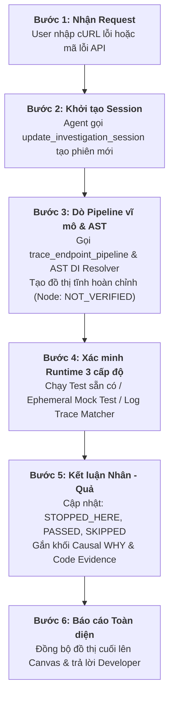

> **Tài liệu dự án:** [Tổng quan dự án](PROJECT_OVERVIEW.md) | [Đặc tả Tech Stack](TECH_STACK.md) | [Đặc tả Nghiệp vụ (BRD)](BUSINESS_REQUIREMENTS.md)

---

# FlowLens: Đặc tả Nghiệp vụ Dự án (Business Requirements Document)

---

## 1. Hệ thống Phân loại Trạng thái & Bằng chứng (Core Taxonomy)

Để đảm bảo tính trung thực, mọi node trong đồ thị thực thi bắt buộc phải tuân theo 2 chiều dữ liệu độc lập:

### 1.1. Execution States (Trạng thái Thực thi)
* **`NOT_VERIFIED`:** Node tồn tại trong mã nguồn tĩnh (được phát hiện qua quét file hoặc call graph), nhưng chưa có dữ liệu runtime để chứng minh nó đã chạy.
* **`PASSED`:** Node đã được xác nhận thực thi thành công thông qua dữ liệu runtime (test pass, trace span, log khớp).
* **`STOPPED_HERE`:** Điểm dừng thực tế của request. Nơi phát sinh lỗi, bị chặn bởi bảo mật/validation, hoặc quăng ngoại lệ (Exception).
* **`SKIPPED`:** Các node nằm sau điểm dừng hoặc thuộc nhánh điều kiện không được kích hoạt. Thể hiện rõ việc tài nguyên (như Database) chưa từng bị chạm tới.

### 1.2. Certainty & Confidence Engine
Mức độ tin cậy được tính theo công thức trọng số:

$$\text{Confidence} = \min\left(1.0, \sum w_i\right)$$

* `+0.4`: Bắt được điểm đón trực tiếp (Annotation / Route Definition).
* `+0.3`: Khớp được lời gọi hàm thật qua `find_symbol_references`.
* `+0.3`: Khớp được frame trong Stack Trace hoặc Trace Span ID từ runner.
* `-0.2`: Trùng tên hàm / Overload mơ hồ không thể giải quyết bằng ngữ cảnh.

**Phân cấp Certainty:**
* `EXPLICIT`: $\text{Confidence} \ge 0.7$ (Có bằng chứng mã nguồn hoặc runtime trực tiếp).
* `INFERRED`: $0 < \text{Confidence} < 0.7$ (Agent suy luận dựa trên cấu trúc nghiệp vụ chuẩn).
* `UNKNOWN`: Hoàn toàn không có dữ liệu đối chiếu trong workspace.

---

## 2. Các Use Cases Cốt lõi (Core Use Cases)

```text
+------------------------------------------------------------------------+
|                      FLOWLENS USE CASE MAP                             |
|                                                                        |
|  [PHÂN TÍCH TĨNH]      UC01: Phân tích Request Entrypoint              |
|                        UC02: Dò vết chuỗi gọi hàm (Symbol Tracing)     |
|                        UC03: Quét Pipeline vĩ mô (Macro Pipeline Trace)|
|                                                                        |
|  [ĐIỀU TRA NHÂN-QUẢ]   UC04: Phân tích rẽ nhánh lỗi (Failure Branches)  |
|                        UC05: Causal WHY Analysis (Tại sao lỗi?)        |
|                        UC06: Xác định điểm chết ("Request chết ở đâu?")|
|                                                                        |
|  [XÁC MINH RUNTIME]    UC07: Tái hiện lỗi qua Sandbox Runner 3 cấp độ  |
|                        UC08: Đối chiếu Luồng kỳ vọng vs Thực tế        |
|                                                                        |
|  [TRỰC QUAN HÓA]       UC09: Quản lý Session & Đẩy trạng thái Canvas   |
+------------------------------------------------------------------------+
```

### UC01: Phân tích Request Entrypoint
* **Tác nhân:** Developer / AI Agent.
* **Đầu vào:** Chuỗi cURL, HTTP Raw Request, hoặc URL path + HTTP method.
* **Xử lý:**
  1. Agent bóc tách method, path, headers, auth token, body.
  2. Gọi `codebase_search` để định vị file Controller/Router chứa endpoint.
  3. Trích xuất file path, line number, các middleware/filter đi kèm.
* **Đầu ra:** Node Entrypoint được tạo với trạng thái `NOT_VERIFIED` và `Certainty: EXPLICIT`.

### UC02: Dò vết chuỗi gọi hàm (Deterministic Symbol Tracing)
* **Tác nhân:** AI Agent / FlowLens MCP Server.
* **Đầu vào:** Tên Handler/Controller và danh sách dependency inject.
* **Xử lý:**
  1. Từ Handler/Controller, Agent xác định các dependency được inject.
  2. Gọi tool `find_symbol_references` kết hợp phân tích cú pháp AST (`web-tree-sitter`) để nhận diện chính xác implementation tương ứng với interface (giải quyết Đa hình & Dependency Injection).
  3. Lắp ráp các bước tiếp theo vào đồ thị tĩnh: Service $\rightarrow$ Helper $\rightarrow$ Repository/Client.
* **Quy tắc:** Không để LLM tự suy diễn hoặc bịa đặt các service không tìm thấy trong kết quả trả về của tool.
* **Đầu ra:** Cây call graph tĩnh gồm các node `NOT_VERIFIED` và liên kết edges chuẩn xác theo luồng inject thực tế.

### UC03: Quét Pipeline vĩ mô (Macro Pipeline Tracing)
* **Tác nhân:** AI Agent / FlowLens MCP Server (`trace_endpoint_pipeline`).
* **Đầu vào:** Endpoint path và HTTP method.
* **Xử lý:**
  1. Thay vì Agent phải gọi tuần tự hàng chục tool call đơn lẻ gây tốn token và latency cao, MCP Server tự động quét phân tích tĩnh toàn bộ chuỗi mắt xích liên đới: Route Handler $\rightarrow$ Filters/Guards $\rightarrow$ Injected Services $\rightarrow$ Data Repositories.
  2. Dựng sẵn khung đồ thị tĩnh ban đầu và gán nhãn `NOT_VERIFIED` cho tất cả các node trong một lượt gọi duy nhất.
  3. Tự động đồng bộ khung sơ bộ lên Canvas qua WebSocket.
* **Đầu ra:** Đồ thị khung tĩnh hoàn chỉnh sau **1 round-trip**, tiết kiệm hơn 70% token context cho AI Agent.

### UC04: Phân tích rẽ nhánh lỗi (Failure Branches)
* **Tác nhân:** AI Agent.
* **Đầu vào:** Mã nguồn tại các điểm kiểm tra logic (Guards, Filters, Validations).
* **Xử lý:**
  1. Agent phân tích các rào chắn điều kiện: Filter bảo mật, Annotation `@PreAuthorize`, DTO validation rules, câu lệnh `if-throw`.
  2. Dựng các nhánh rẽ lỗi song song với Happy Path (ví dụ: `401 Unauthorized`, `403 Forbidden`, `400 Bad Request`).
* **Đầu ra:** Các node nhánh rẽ lỗi (Failure Nodes) gắn kèm điều kiện kích hoạt.

### UC05: Causal WHY Analysis (Phân tích nhân-quả)
* **Tác nhân:** AI Agent.
* **Đầu vào:** Dữ liệu Request thực tế kết hợp điều kiện logic trong code.
* **Xử lý:** Khi một nhánh lỗi được chọn hoặc phát hiện:
  1. Agent so sánh dữ liệu đầu vào thực tế từ Request với điều kiện logic trong code.
  2. Sinh ra cấu trúc phân tích 3 thành phần:
     * **Condition:** Điều kiện cần để đi tiếp (ví dụ: Yêu cầu quyền `ROLE_ADMIN`).
     * **Actual State:** Dữ liệu thực tế gửi lên (ví dụ: Token mang quyền `ROLE_USER`).
     * **Verdict:** Kết luận nguyên nhân mã lỗi (`403 Forbidden`).
* **Đầu ra:** Khối Causal Card (Condition - Actual State - Verdict) đính kèm vào node.

### UC06: Xác định điểm chết ("Request chết ở đâu?")
* **Tác nhân:** AI Agent / FlowLens State Engine.
* **Đầu vào:** Kết quả phân tích Causal WHY hoặc Stack Trace từ runtime runner.
* **Xử lý:**
  1. Đánh dấu node vi phạm điều kiện là `STOPPED_HERE`.
  2. Đánh dấu tất cả các node phía sau điểm dừng là `SKIPPED`.
  3. Highlight cảnh báo: *"Logic xử lý nghiệp vụ chính và tầng Database chưa từng được kích hoạt"*.
* **Đầu ra:** Đồ thị trực quan với node `STOPPED_HERE` (màu đỏ/cảnh báo) và chuỗi node `SKIPPED` (màu xám mờ).

### UC07: Tái hiện lỗi qua Sandbox Runner 3 cấp độ (Adaptive Runtime Verification)
* **Tác nhân:** AI Agent / Safe Command Dispatcher (`execute_sandboxed_runner`).
* **Đầu vào:** Thông tin endpoint lỗi, dữ liệu request, và môi trường dự án.
* **Xử lý theo 3 cấp độ linh hoạt:**
  * **Cấp 1 - Active Test Suite:** Nếu có sẵn unit/integration test $\rightarrow$ chạy trực tiếp qua `execute_sandboxed_runner` (`mvn`, `gradle`, `npm`, `pytest`, `go`).
  * **Cấp 2 - Ephemeral Mock Test:** Nếu thiếu test có sẵn $\rightarrow$ Agent tự sinh file test mock tạm thời (sử dụng test harness của framework như `MockMvc`, `supertest`, `pytest-mock`), bơm payload lỗi vào để tái hiện cô lập mà không cần external database.
  * **Cấp 3 - Passive Log / Trace Matcher:** Nếu không thể chạy lệnh $\rightarrow$ Đọc trực tiếp log file hoặc OpenTelemetry trace span có sẵn để khớp chuỗi Stack Trace với source code.
* **Đầu ra:** Bằng chứng runtime xác thực (Test output, exit code, hoặc log/trace span khớp chính xác dòng code).

### UC08: Đối chiếu Luồng kỳ vọng vs Thực tế (Expected vs. Actual)
* **Tác nhân:** AI Agent / React Flow Visualizer.
* **Đầu vào:** Đồ thị tĩnh (Expected Path) và kết quả runtime (Actual Path).
* **Xử lý:** So sánh cấu trúc đồ thị suy luận từ code tĩnh với kết quả thực thi runtime:
  * **Expected:** Controller $\rightarrow$ Service $\rightarrow$ Repository $\rightarrow$ Database.
  * **Actual:** Controller $\rightarrow$ Service $\rightarrow$ External Payment API $\rightarrow$ Timeout (`500`).
  * Hệ thống làm nổi bật sự chệch hướng và cảnh báo điểm gãy luồng.
* **Đầu ra:** Visual diff trực quan trên Canvas giữa luồng thiết kế và luồng thực tế.

### UC09: Quản lý Session & Đồng bộ Canvas
* **Tác nhân:** FlowLens MCP Server / WebSocket Hub.
* **Đầu vào:** Payload cập nhật session từ AI Agent.
* **Xử lý:**
  1. MCP Server khởi tạo một phiên điều tra (`InvestigationSession`) gồm ID, danh sách bước (`steps`), và đồ thị (`nodes`, `edges`).
  2. Mỗi khi Agent hoàn thành một bước điều tra, gọi `update_investigation_session`.
  3. Server lưu vào Store nội bộ, tính toán lại Confidence bằng công thức, và bắn sự kiện qua WebSocket tới Canvas.
* **Đầu ra:** Canvas tự động re-render tức thì theo thời gian thực mà không cần reload trang.

---

## 3. Quy trình điều tra chuẩn của Agent (Investigation Protocol)



1. **Bước 1: Nhận Request:** User cung cấp lệnh cURL lỗi, HTTP raw request hoặc mã lỗi API kèm mô tả sự cố.
2. **Bước 2: Khởi tạo Session:** Agent gọi tool `update_investigation_session` để tạo phiên điều tra mới và kích hoạt kết nối WebSocket trên cổng 9876.
3. **Bước 3: Dò Pipeline vĩ mô & AST:** Sử dụng `trace_endpoint_pipeline` và `web-tree-sitter` để bóc tách luồng Controller $\rightarrow$ Filter $\rightarrow$ Injected Service $\rightarrow$ Repo trong **1 round-trip duy nhất**, gán trạng thái ban đầu là `NOT_VERIFIED`.
4. **Bước 4: Xác minh Runtime 3 cấp độ:** Thực thi kiểm chứng qua Active Test Runner, Ephemeral Mock Test (tạo file test tạm), hoặc Passive Log/Trace Matcher để lấy bằng chứng thực thi thực tế.
5. **Bước 5: Kết luận Nhân - Quả:** Đánh dấu node gây lỗi là `STOPPED_HERE`, các node đã chạy qua thành công là `PASSED`, các node phía sau thành `SKIPPED`. Gắn khối phân tích WHY (Condition vs Actual) và Code Evidence (file, line number, code snippet).
6. **Bước 6: Báo cáo Toàn diện:** Server tự động đồng bộ đồ thị hoàn chỉnh lên FlowLens Canvas qua WebSocket và Agent đưa ra câu trả lời giải thích nguyên nhân gốc rễ cùng đề xuất sửa code cho developer.