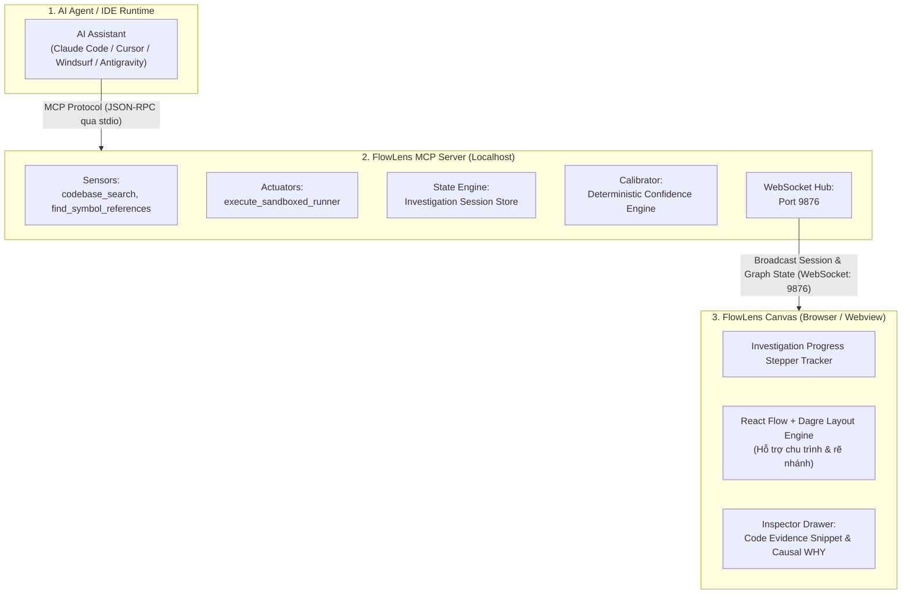

> **Tài liệu dự án:** [Tổng quan dự án](PROJECT_OVERVIEW.md) | [Đặc tả Tech Stack](TECH_STACK.md) | [Đặc tả Nghiệp vụ (BRD)](BUSINESS_REQUIREMENTS.md)

---

# FlowLens: Universal API Execution Debugger & Real-time Causal Canvas

> **Codename:** FlowLens  
> **Type:** Model Context Protocol (MCP) Server + Real-time Interactive Web Canvas  
> **Core Value:** Tự động điều tra nguyên nhân gốc rễ (Root Cause), đối chiếu luồng tĩnh và động (Static vs. Runtime), chứng minh bằng chứng thực thi bằng mã nguồn thật (Zero-Hallucination).

---

## 1. Bối cảnh & Bài toán thực tế

Khi phát triển, bảo trì hoặc kiểm thử các hệ thống backend, lập trình viên thường xuyên đối mặt với các vấn đề:

* **Hộp đen API (Blackbox Execution):** Khi nhận mã lỗi `400 Bad Request`, `403 Forbidden` hoặc `500 Internal Server Error`, lập trình viên phải tự lần qua nhiều tầng middleware, filter, controller, service, và database client để đoán xem request bị chặn ở đâu.
* **Sự sai lệch giữa Code tĩnh và Thực tế chạy (Expected vs. Actual):** Code có thể định nghĩa việc lưu dữ liệu vào database, nhưng runtime lại dừng ngay tại một external client bị timeout mà database chưa từng được chạm tới.
* **Hạn chế của AI Chatbot thông thường:** Các trợ lý AI thông thường chỉ nhận code được copy-paste thủ công, dễ bị ảo giác (hallucination), không kiểm chứng được call graph thực tế trên repo lớn, và không có khả năng kích hoạt test runner để xác thực giả thuyết.

---

## 2. Tầm nhìn & Giải pháp của FlowLens

FlowLens định vị là một **Investigation Copilot** chạy cục bộ thông qua giao thức MCP (Model Context Protocol). Hệ thống hoạt động theo nguyên tắc tam giác phân vai:

1. **AI Agent (The Brain):** Đọc hiểu ngữ nghĩa, suy luận nhân-quả (Causal Reasoning), giải thích nguyên nhân rẽ nhánh và lập kế hoạch điều tra.
2. **FlowLens MCP Server (The Sensors & Actuators):** Đóng vai trò giác quan và công cụ hành động. Quét symbol, tìm kiếm reference xác định (Deterministic AST/Regex), thực thi test an toàn trong sandbox, và quản lý trạng thái phiên điều tra.
3. **FlowLens Canvas (The Visualization):** Màn hình trực quan hóa thời gian thực, vẽ sơ đồ thực thi có chu trình (Execution Graph), highlight điểm chết của request và hiển thị bằng chứng dòng code.

---

## 3. Kiến trúc tổng thể 3 tầng



```text
+-------------------------------------------------------------------------------+
|                            AI AGENT / IDE RUNTIME                             |
|   (Claude Code / Cursor / Windsurf / Antigravity)                             |
|         │                                                                     |
|         │ 1. MCP Protocol (JSON-RPC qua stdio)                                |
|         ▼                                                                     |
|   +-----------------------------------------------------------------------+   |
|   |                      FlowLens MCP Server (Local)                      |   |
|   |                                                                       |   |
|   |  - Sensors: codebase_search, find_symbol_references                   |   |
|   |  - Actuators: execute_sandboxed_runner (Whitelisted Runners)          |   |
|   |  - State Engine: Investigation Session Store                          |   |
|   |  - Calibrator: Deterministic Confidence Engine                        |   |
|   |  - WebSocket Hub: Port 9876                                           |   |
|   +-----------------------------------------------------------------------+   |
|         │                                                                     |
|         │ 2. Broadcast Session & Graph State (WebSocket Event)                |
|         ▼                                                                     |
|   +-----------------------------------------------------------------------+   |
|   |                   FlowLens Canvas (Browser / Webview)                 |   |
|   |                                                                       |   |
|   |  - Investigation Progress Stepper Tracker                             |   |
|   |  - React Flow + Dagre Layout Engine (Hỗ trợ chu trình & rẽ nhánh)     |   |
|   |  - Inspector Drawer: Code Evidence Snippet & Causal WHY Analysis      |   |
|   +-----------------------------------------------------------------------+   |
+-------------------------------------------------------------------------------+
```

---

## 4. Các điểm khác biệt cốt lõi (Key Differentiators)

* **Language-Agnostic tuyệt đối:** Không viết parser riêng cho từng ngôn ngữ. MCP Server chỉ cung cấp các công cụ tìm kiếm và thực thi chuẩn; AI Agent tự nhận biết cú pháp (Java, TypeScript, Python, Go, Rust).
* **Deterministic Fact, AI Meaning:** Việc xác định symbol tồn tại ở file nào, dòng nào do Tool đảm bảo 100%. AI chỉ tập trung giải thích ý nghĩa logic và nguyên nhân.
* **Deterministic Confidence Engine:** Điểm tin cậy không do AI tự chấm bừa, mà được máy chủ tính toán qua trọng số bằng chứng thu thập được.
* **Execution Graph thay vì DAG tĩnh:** Hỗ trợ biểu diễn các vòng lặp retry, polling bất đồng bộ, và phân biệt rõ ràng giữa code tồn tại trên đĩa (`NOT_VERIFIED`) với code thực sự được chạy (`PASSED`, `STOPPED_HERE`, `SKIPPED`).

---

## 5. Chiến lược Kiến trúc Khắc phục Điểm nghẽn Thực tế (Architecture Solutions)

Để đảm bảo FlowLens không chỉ là mô hình lý thuyết mà hoạt động trơn tru trong các hệ thống doanh nghiệp phức tạp, kiến trúc được bổ sung 3 giải pháp trọng yếu:

### 5.1. Xử lý Đa hình & Dependency Injection (Tree-sitter WASM + DI Resolver)
* **Thực tế:** Trong các framework lớn (Spring Boot, NestJS, ASP.NET Core, Go Interfaces), một interface thường có nhiều implementations. Nếu chỉ dùng text regex hoặc Ripgrep thông thường, hệ thống sẽ trả về nhiều kết quả nhiễu khiến AI Agent bối rối.
* **Giải pháp:** Sử dụng **Tree-sitter WASM** siêu nhẹ (khởi động tức thì, không tốn RAM như Language Server Protocol). FlowLens phân tích cây cú pháp trừu tượng (AST) cục bộ để nhận diện các annotation nạp Bean (`@Service`, `@Component`, `@Primary`, `@Injectable`) và file cấu hình, giúp Agent định vị chính xác implementation thực sự được kích hoạt tại runtime.

### 5.2. Cơ chế Xác minh Runtime 3 cấp độ (Adaptive Runtime Verification)
* **Thực tế:** Không phải endpoint nào gặp lỗi cũng có sẵn unit test, và không phải lập trình viên nào cũng có sẵn local database/Docker đang chạy để test runner thực thi thành công.
* **Giải pháp 3 cấp độ linh hoạt:**
  1. **Level 1 - Active Test Runner:** Thực thi trực tiếp test suite có sẵn qua `execute_sandboxed_runner` (Maven, Gradle, NPM, Pytest, Go).
  2. **Level 2 - Ephemeral Mock Test Generator:** Khi thiếu test có sẵn, Agent sử dụng mock harness chuẩn của framework (`MockMvc`, `supertest`, `httptest`, `pytest-mock`) để tạo file test cô lập tạm thời, bơm payload lỗi vào để tái hiện mà không phụ thuộc DB ngoài.
  3. **Level 3 - Passive Log & Trace Matcher:** Trường hợp không thể chạy test (thiếu quyền, môi trường đặc thù), hệ thống đọc và so khớp trực tiếp chuỗi nhật ký lỗi (App Logs, OpenTelemetry spans, Stack Trace sẵn có) với đồ thị tĩnh để định vị node `STOPPED_HERE`.

### 5.3. Tối ưu hóa Context Window & Token Latency (Composite Macro Tools)
* **Thực tế:** Nếu Agent phải gọi 15–20 tool calls đơn lẻ để dò từng bước từ Controller $\rightarrow$ Filter $\rightarrow$ Service $\rightarrow$ Helper $\rightarrow$ Repo, cửa sổ ngữ cảnh (Context Window) sẽ nhanh chóng phình to và độ trễ phản hồi quá cao.
* **Giải pháp:** Cung cấp **Composite Macro Tool** `trace_endpoint_pipeline`. MCP Server tự động quét và dựng sẵn toàn bộ khung pipeline chính trong một lần gọi (1 round-trip). Agent chỉ cần tập trung gọi thêm tool chi tiết tại các điểm phân nhánh logic phức tạp.